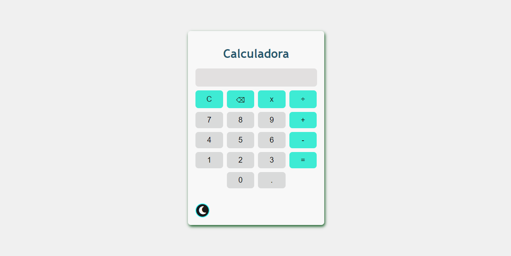
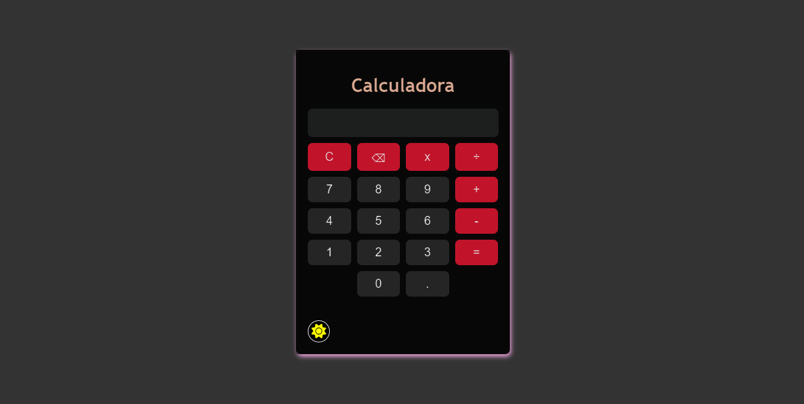

# Calculadora-Moderna

He utilizado HTML, CSS y Javascritp, para lograr una calculadora moderna y capaz de realizar las operaciones matematicas basicas, 
he agregado un tema claro y uno oscuro para un mejor uso en ambientes con poca o mucha luz.

